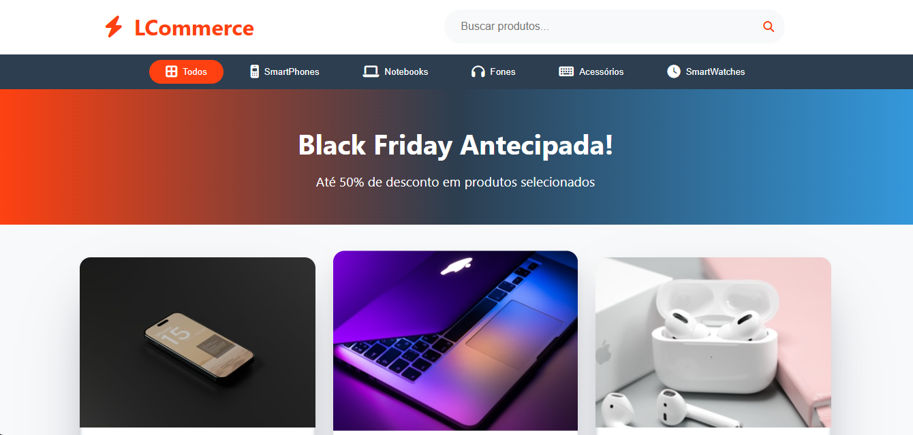

# ⚡ TechCommerce

Projeto de Front-End para um e-commerce moderno, desenvolvido como prática de HTML, CSS e JavaScript. Totalmente resposivo, onde a proposta foi criar a interface de uma loja online e funcional visualmente, com foco em organização, responsividade e código limpo.

## 🧰 Tecnologias Utilizadas

- **HTML Semântico** – Estrutura organizada para melhor acessibilidade e SEO.
- **CSS3** – Estilização moderna com animações e responsividade.
- **JavaScript (ES6+)** – Lógica aplicada para funcionalidades básicas como renderização de produtos.
- **Modularização com arquivos JS**:
  - Um arquivo contém os scripts principais do site.
  - Outro contém o array de produtos, mantendo a separação de responsabilidades (clean code).

## 🔍 Funcionalidades Implementadas

- Página inicial com destaque para promoções (Black Friday).
- Barra de navegação por categorias: Smartphones, Notebooks, Fones, Acessórios, SmartWatches.
- Renderização dinâmica de produtos a partir de um array.
- Sistema de busca de produtos.
- Layout responsivo e moderno.
- Exibição de produtos com desconto, preço original e descrição
- Layout responsivo e moderno
- Efeitos visuais ao passar o mouse nos cards dos produtos

## 🗂 Estrutura do Projeto

├── index.html
├── style.css
├── products.js
├── scripts.js
└── assets/

## 🚧 O que falta para funcionar completamente

- Integração com backend (banco de dados, autenticação, carrinho, pagamentos etc.)
- Adição de funcionalidades completas (carrinho de compras, login, filtros etc.)

## 🚀 Como usar

1. Clone ou baixe este repositório.
2. Abra o arquivo `index.html` em seu navegador.
3. Utilize a barra de busca ou os botões de categoria para filtrar os produtos exibidos.

## 🖼 Créditos das Imagens

As imagens dos produtos são retiradas do [Unsplash](https://unsplash.com/) e de sites oficiais das marcas.  
Elas são utilizadas apenas para fins educacionais e ilustrativos.

## 📌 Objetivo

Este projeto foi criado com foco no desenvolvimento Front-End e organização do código. Serve como base para futuros projetos mais completos com backend.

## 📸 Preview do Projeto

---

👨‍💻 **Desenvolvedor:** <strong>leandro m silva</strong>  
📅 **Data de criação:** Agosto/2025
